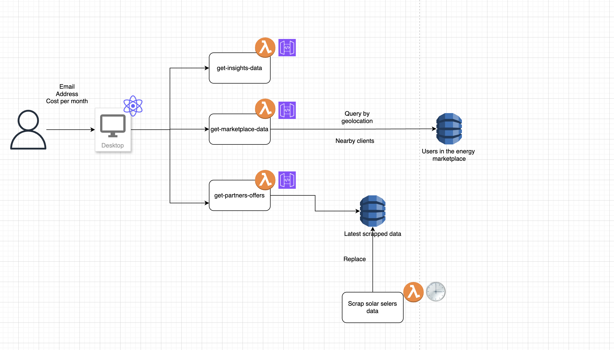

# OptiEnergy
OptiEnergy is a web-based platform aimed to provide a simple and user friendly way for users to invest in green energy.

## Features

### Implemented Features
- <b>Solar Panel Suitability Check:</b> Users can input their address to determine if their house is suitable for solar panels, the required investment, and the return on investment (ROI) period.

### Mocked Features
- <b>Neighbor Energy Marketplace:</b> Shows neighbors who already have solar energy and are willing to sell it, providing an alternative for users who don't want or can't invest in solar panels.
- <b>Provider Listings:</b> Displays a list of solar panel providers and their prices for users interested in investing in solar panels.

## Architecture

The architecture of OptiEnergy leverages modern web technologies to provide a scalable and efficient platform. The frontend is built with React and Vite, while the backend uses AWS Lambda functions managed by the Serverless Framework. This setup ensures a serverless, cost-effective, and highly scalable infrastructure.




## Tech Stack

- <b>Frontend:</b> React, Vite, JavaScript
- <b>Backend: </b> AWS Lambda, Serverless Framework, JavaScript
- <b>Cloud Provider: AWS </b>

## Installation and Running Instructions

### Prerequisites
- Node.js (>= 14.x)
- AWS CLI configured with appropriate permissions
- Serverless Framework (`npm install -g serverless`)


### Frontend

1. Clone the repository:

```sh
git clone git@github.com:Vinny-Bass/greenhack-prague.git
cd greenhack-prague
```

2. Navigate to the frontend directory:

```sh
cd frontend/opt-energy
```

3. Install dependencies:

```sh
npm install
```

4. Run the development server:

```sh
npm run dev
```
### Backend

1. Navigate to the backend directory:

```sh
cd backend
```

2. Select the service you want to change/test:

```sh
cd lambdas/<service_name>
npm install
```

3. To run offline:

```sh
sls offline
```

Now you can change the env in the frontend to http://localhost:<port_of_service>

## Contributing
Contributions are welcome! Please fork the repository and use a feature branch. Pull requests are reviewed and merged based on their innovation, usability, sustainability, and scalability.

## License
This project is licensed under the MIT License. See the LICENSE file for more details.